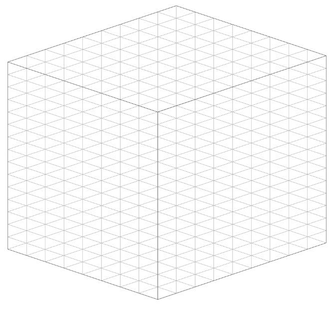
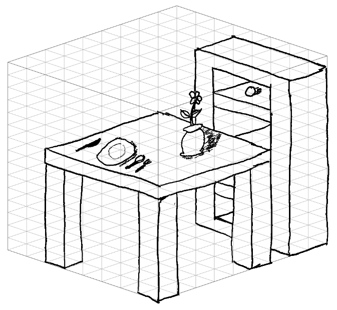

# noso template creator -- for reMarkable 2

This is a tool to create not-really-isometric drawing templates for the reMarkable 2 e-ink drawing tablet.

Not-really-isometric -- nosometric -- noso.

It's not perfect and it breaks in some instances. But it built what I needed it to.

Play with it at https://robotcaleb.github.io/noso_template/

Tweak the sliders and click the "Save template" button.

---

Once downloaded, rename the `.png` and `.svg` and place on your device at `/usr/share/remarkable/templates/` and update the `templates.json` file. Recommend using `templatectl` - https://github.com/PeterGrace/templatectl
